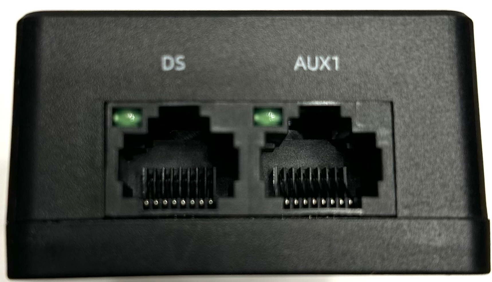
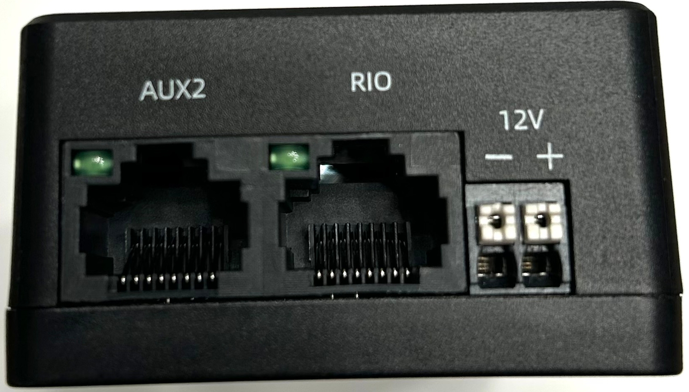

# Vivid Hosting FRC Radio (VH-109)

## Radio Firmware

- Ensure you have the [latest firmware installed](https://frc-radio.vivid-hosting.net/miscellaneous/firmware-releases)
- WPI Lib firmware update [instructions](https://docs.wpilib.org/en/stable/docs/zero-to-robot/step-3/radio-programming.html#radio-firmware-update)

## Electrical Specs

:lucide-triangle-alert: The VH-109 radio must be on a 10A fuse.

:lucide-octagon-alert: DO NOT use both 12v and PoE to power the radio.

## Ethernet Ports

| Port Name | Connect To | PoE Capable   |
| --------- | ---------- | ------------- |
| RIO       | roboRIO    | 4.5-19V Input |
| DS        | Laptop     | No            |
| AUX1      |            | Yes           |
| AUX2      |            | Yes           |

{ align=right width=200 }
{ align=right width=200 }

---

## Direct Connection

If you cannot reach the radio over WiFi, connect an ethernet cable to the `DS` ethernet port.

| Computer Settings |                         |
| ----------------- | ----------------------- |
| IP Address        | `192.168.69.2`          |
| Subnet Mask       | `255.255.255.0`         |
| Gateway           | Leave Blank             |
| DNS               | `192.168.69.1` or Blank |

Navigate to `http://192.168.69.1/` or `http://radio.local`

## Reference Docs

- :lucide-globe: [Vivid Hosting FRC Radio](https://frc-radio.vivid-hosting.net/)
